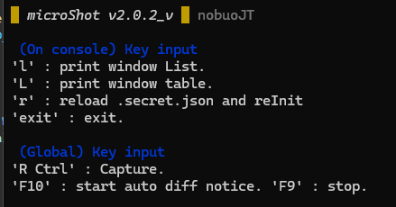

# microShot2 : screen shot tool
v2.0.1_n

オフフォーカス、1keyでウィンドウのスクショ画像を撮影。  
指定秒数ずつ差分をとり差分が大きい場合はdiscordに通知する。  
CLIです。

continue from [microShot(Legacy)](https://github.com/NobuoJt/microShot/blob/main/readme.md) (Private Repo)



## Usage
```ts-node index.ts``` or 
```dist/microShot.exe```

## Key (Focus)
It's means console input.

### ```l``` Show window List(summary)
- info by window Table

### ```L``` Show window List(detail)
- appName List

### ```exit``` Exit

### ```r``` Reload
- Reload ```.secret.json``` and Reinitialize

## Key (Global)

Even if the window is not in focus.

### ```Right Ctrl``` One shot capture
- ```targetWindows.secret```の各行とマッチするappNameが対象
- ファイル名は```pix/{appName}_{YYYY}_{M}_{D} {h}_{m}_{s}```

### ```F10``` Start diff notice
- ```targetAutoWindows.secret```の各行とマッチするappNameが対象
- ```url.secret``` の"discord"フィールドにあるwebhookに投げる。
- 変化がある場合、Discordに通知(interval=5000ms)
- diffチャンネル

### ```F9``` Stop diff notice

## ```.secret.json``` の書き方

```json
{
    "DISCORD_POST_URL":"https://discord.com/api/webhooks/{ほげほげ}",
    "TARGET_WINDOW":{
        "ONE_SHOT":   ["エクスプローラー"],
        "AUTO":       ["エクスプローラー"]
    },
    "TOLERANCE":20 
}
```
|Entry|Desc.|
|-|-|
|DISCORD_POST_URL           |WebHookを発火させるURL|
|TARGET_WINDOW / ONE_SHOT   |スクショ対象ウィンドウ名(List)
|TARGET_WINDOW / AUTO       |diff notice対象ウィンドウ名(List)


## npm run スクリプト一覧

### index.ts→node実行
```npm start``` init  
```rs``` リセット

### 一連のコンパイル  
以下のスクリプトを逐次実行。  
*ルートディレクトリで行ってください。*  

```npm run compile``` js → ts → cjs → blob → exe

### tscコンパイル ts → js

```npm run build_j``` tsc -p .

### esbuildバンドル (jsのmoduleを組み込み)

```npm run build_i```

### exe化
nodeの新機能SEAを使う。
試験機能のため警告が出る。

```npm run build_e```

### 組み込めないnativeなmoduleを同袍

```npm run build_after```

## File Tree


|Files||
|-|-|
   package*.json | Node 設定ファイル
   index.ts | メインコード
   .secret.json | 本プログラム用設定ファイル
   .gitignore | 
   tsconfig.json | index.ts -> build/index.js

|Folders|File||
|-|-|-|
schema/ || 
-|s.schema.json|            .secret.jsonの書き方を定義
node_modules/||             dev用module(full)
dist/||                     配布用最小構成
-|node_modules/|            NativeModule関連のみ同袍
-|pix/|                     スクショ出力
-|.secret.json, .example|   設定ファイル例
-|microShot.exe|            本プログラム
build/||                    中間ファイル・ビルド定義
-|compile_exe.ps1|          Node-SEAでEXE化スクリプト
-|getNativeModule_4minimum.ps1|要求NativeModule持ってくる
-|index.js|                 tscによりJS化されたTS
-|index_integrated.js|      esbuildによりバインドされたcjs
-|package*.json|            コピー 
-|sea-config.json|          Node-SEAでEXE化するための設定

## ライセンス関連

これ自体はMIT。  
詳細は ```license_detail/```で、

|||
|-|-|
NOTICE| Apache 2.0, CC-BYの継承部分
license_sum|npx license-checkerの結果の一部
license_links|license_sumのリンク部分
get_license_files.ps1|license_linksからLICENSE本文を引っ張ってくるスクリプト
thirdParty/|引っ張ってきたLICENSE本文たち